# Testes — 2ª Atividade Complementar (v2)

Evidências da atualização do projeto para a versão 2, conforme o passo 6 do
gabarito. Testes feitos em 27/09/2026.

- **Repositório:** https://github.com/SN-2026-ANA/1-A-A-2Tri-Ana
- **Painel:** https://sn-2026-ana.github.io/1-A-A-2Tri-Ana/

## Mudanças realizadas

| Arquivo | Mudança |
|---|---|
| `scripts/fetch_flights.py` | v2: logs "enviados/processados", status `erro_parcial`/`erro_critico`, `exit 1` em falha parcial, `execucoes` com `voos_processados`, `lotes_enviados` e `erros` |
| `scripts/fetch_historico_anac.py` | Novo: importa o VRA mensal da ANAC para a tabela `historico_vra` |
| `.github/workflows/update-flights.yml` | v2: `permissions: contents: read`, `concurrency` e `timeout-minutes: 10` |
| `.github/workflows/importar-historico.yml` | Novo: importação do VRA todo dia 3, ou manual com o input `ano_mes` |
| `index.html` | v2: abas Voos do dia, Histórico ANAC e Pipeline |
| `sql/setup.sql` | v2: tabelas `aeroportos`, `voos`, `execucoes` e `historico_vra`, com RLS, policies e GRANTs |

### Ajustes do gabarito aplicados

| Ajuste | Arquivo | Correção |
|---|---|---|
| 1-A (banco) | `sql/setup.sql` | `security_invoker = on` na view `voos_completo` |
| 1-B | `scripts/fetch_flights.py` | Função `deduplicar` antes do upsert |
| 1-A e 2-A (VRA) | `scripts/fetch_historico_anac.py` | URL `Voo Regular Ativo (VRA)/AAAA/MM - Mês/VRA_AAAAM.csv`, arquivo em UTF-8 com BOM, cabeçalho na 2ª linha e nomes reais das colunas |

## Resultados dos testes

### Pipeline SIROS → Supabase

Execução manual, com ícone verde.

| Métrica | 1ª execução (18:49 UTC) | 2ª execução (18:57 UTC) |
|---|---|---|
| Voos retornados pela API SIROS | 2.850 | 8.550 |
| Filtrados para os 41 aeroportos | 2.632 | 7.896 |
| Duplicados removidos antes do envio | 1 | 5.265 |
| Enviados/processados | 2.631 em 6 lotes | 2.631 em 6 lotes |
| Erros / status | 0 / `concluido` | 0 / `concluido` |

Na 2ª execução, a API devolveu os mesmos voos repetidos. A função `deduplicar`
(ajuste 1-B) removeu as repetições, e o upsert manteve os mesmos 2.631 voos, sem
duplicar nada no banco. Sem esse ajuste, o Supabase recusaria os lotes com
chaves repetidas.

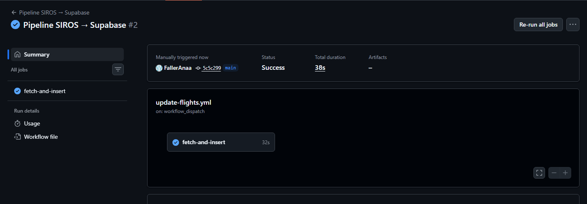
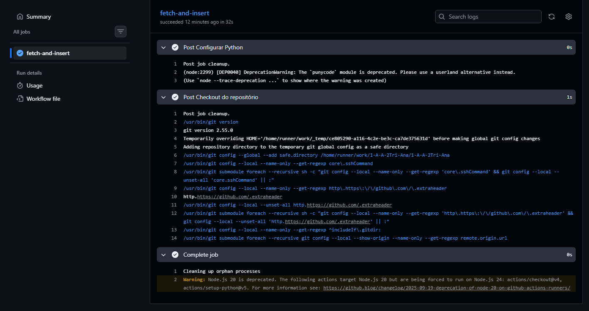

### Tabela execucoes

Registra os novos campos `voos_processados`, `lotes_enviados` e `erros`.

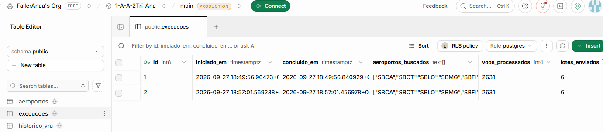
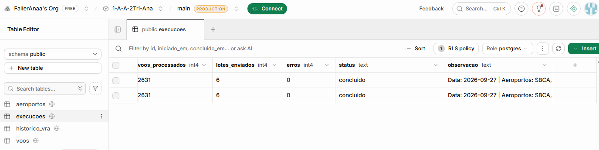

### Importar Histórico ANAC/VRA

| Execução | Mês | Resultado |
|---|---|---|
| #1 | 2026-08 | Verde, sem importar: o VRA de agosto ainda não estava publicado no portal da ANAC (404) |
| #2 | 2026-07 | Verde: 89.517 linhas no VRA, 79.810 filtradas, 2 duplicados removidos, **79.808 registros importados** |

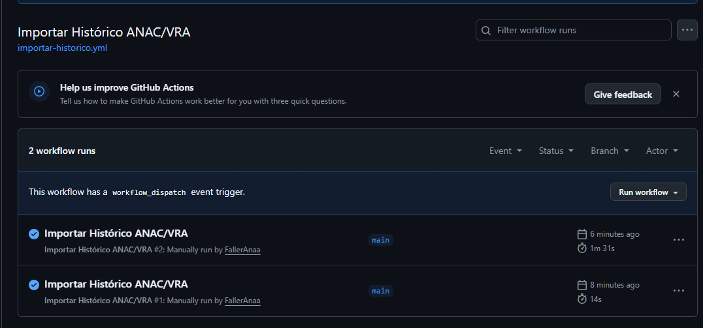

### Tabela historico_vra

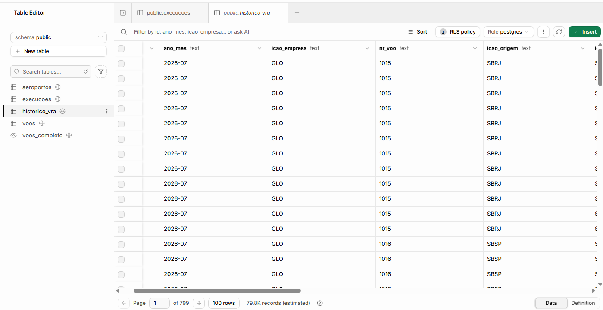
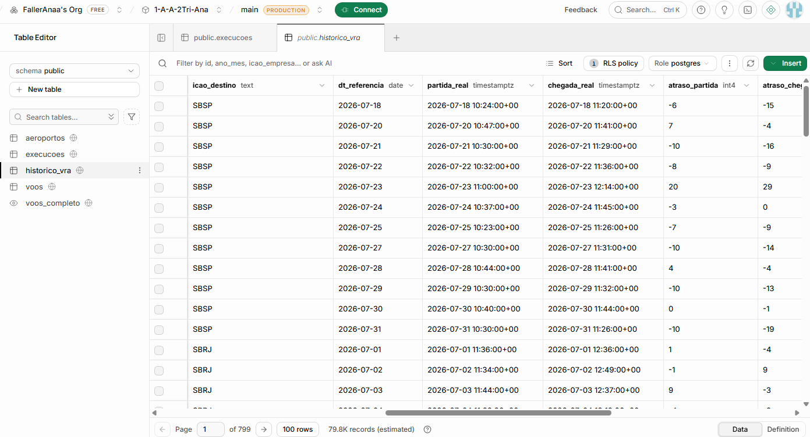
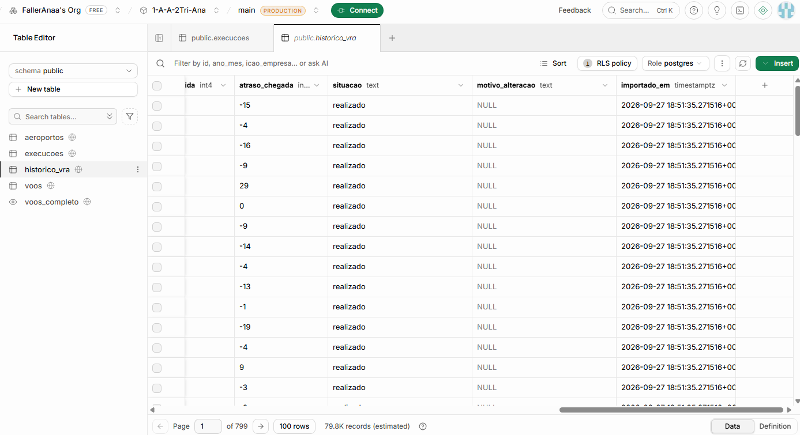

### Painel — aba Histórico ANAC

Consulta de SBCA em julho de 2026: 358 voos, 341 realizados, 17 cancelados e
atraso médio de 27 minutos na partida.

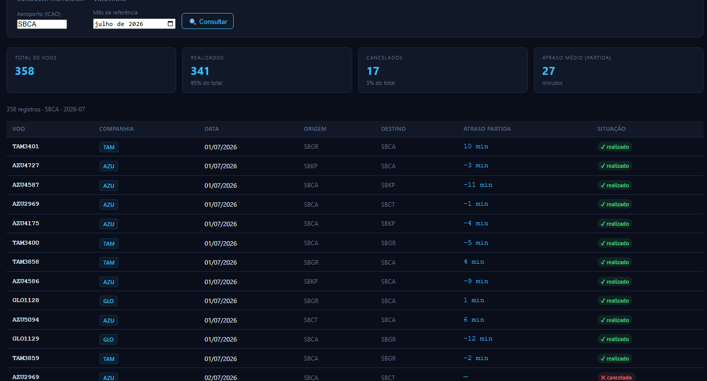

## Correção da atividade

Verificação dos três itens enviados pelo professor como correção.

### A — Consultas de diagnóstico no banco (ajuste 1-C)

| Consulta | Resultado |
|---|---|
| 1. Total de registros em `voos` | 2631 |
| 2. Datas existentes | 2026-09-27, com 2631 voos |
| 3. Cinco registros mais recentes | 5 voos de 2026-09-27, inseridos às 18:49 UTC |
| 4. Log de execuções | 2 execuções `concluido`: 2631 processados, 6 lotes, 0 erros |

A consulta 4 mostra que o pipeline registrou as duas execuções sem erro.

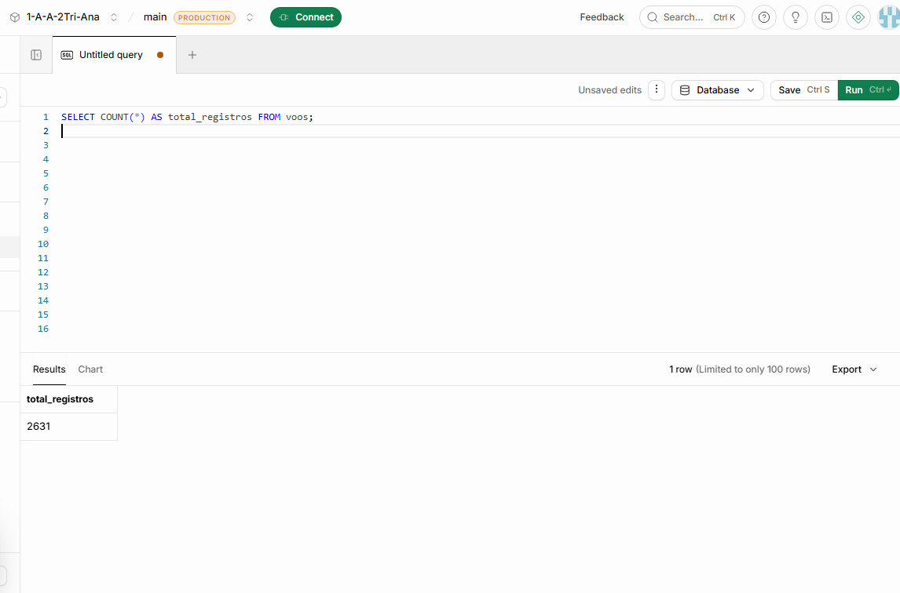
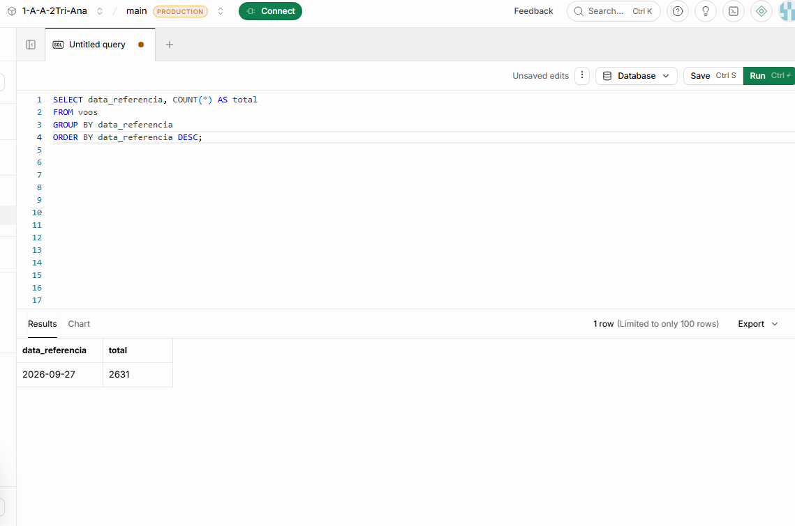
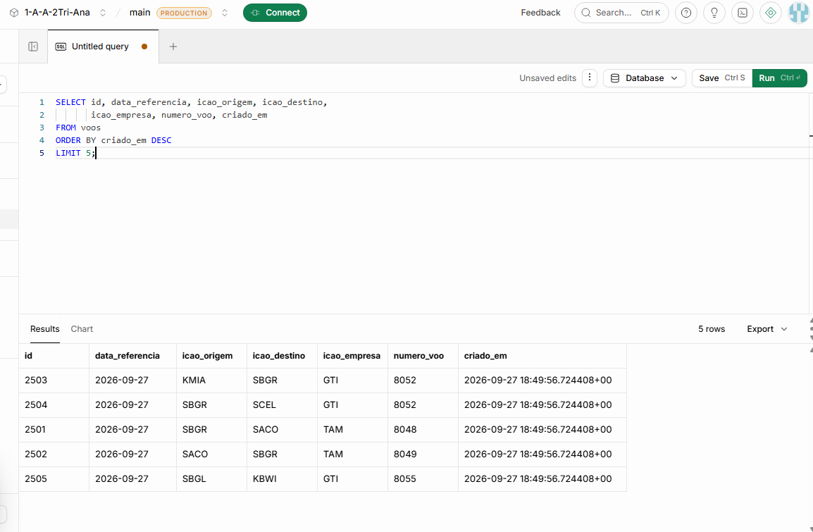
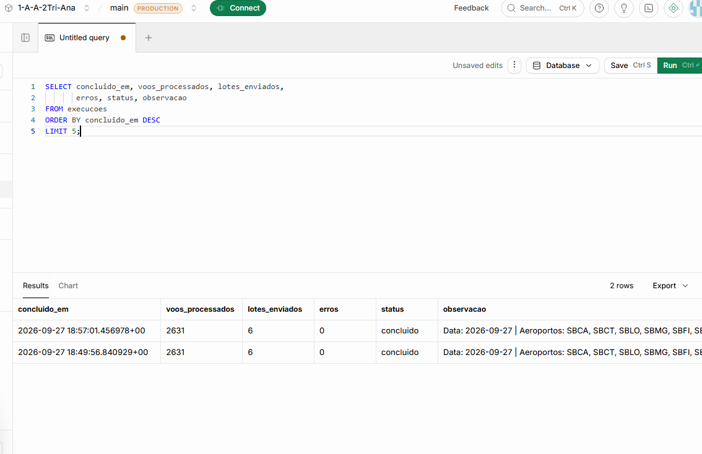

### B — Remoção de duplicatas no fetch_flights.py (ajuste 1-B)

A função `deduplicar` foi aplicada antes do envio em lotes. O PostgreSQL não
aceita que o mesmo `ON CONFLICT DO UPDATE` afete a mesma linha duas vezes na
mesma operação. Na 2ª execução do pipeline, ela removeu 5.265 voos repetidos
devolvidos pela API SIROS (veja `workflow-v2-log.png`).

### C — Link correto do VRA (ajustes 1-A e 2-A)

O script usa a estrutura
`/Voos e operações aéreas/Voo Regular Ativo (VRA)/AAAA/MM - Mês/VRA_AAAAM.csv`.
O log da importação mostra o arquivo de julho de 2026 baixado, o cabeçalho real
da ANAC detectado na linha 2 e os 160 lotes enviados sem erro. O Summary do run
resume a importação.

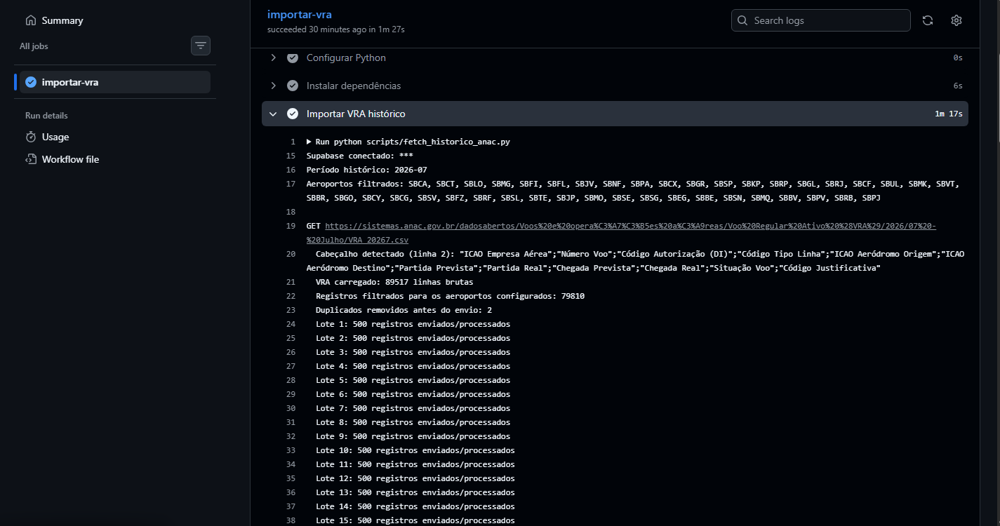
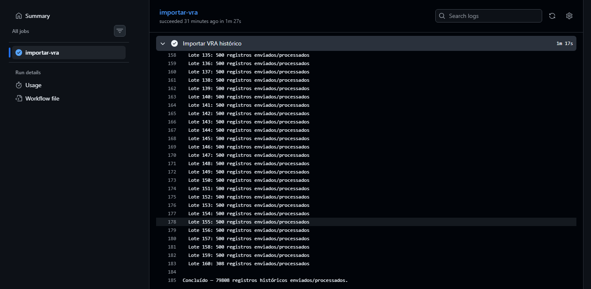
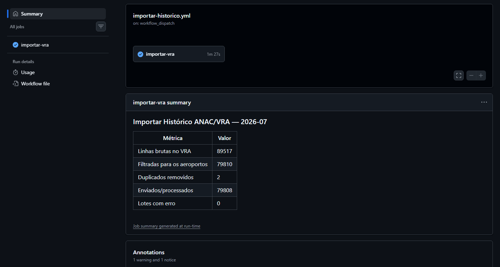
